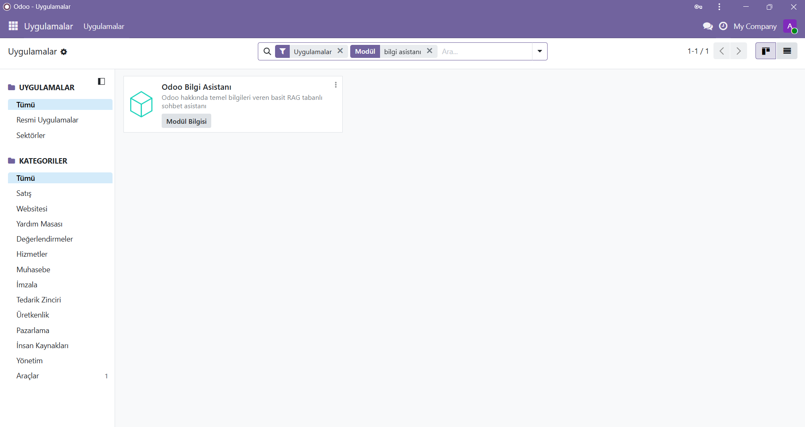
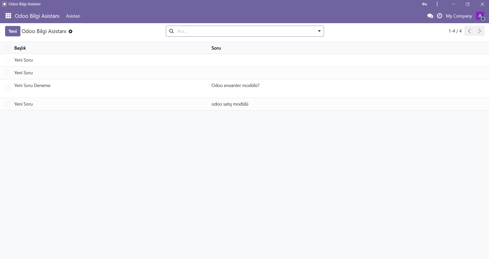
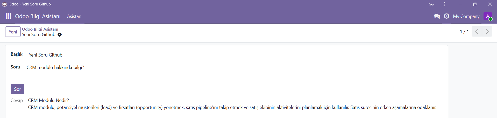
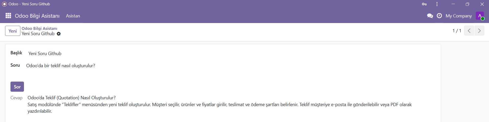

# Odoo RAG Knowledge Assistant (Offline AI Module)

## 📌 Project Overview

Odoo RAG Knowledge Assistant is a custom Odoo module that provides a lightweight, offline, AI-style chatbot experience inside Odoo ERP.

The module allows users to ask questions about Odoo concepts, modules, and workflows.  
Instead of using external APIs or cloud AI services, the system retrieves relevant information from a local knowledge base and displays context-based answers directly inside Odoo.

This project focuses on:

- Custom Odoo module development
- Offline Retrieval-Augmented Generation (RAG) logic
- Simple and explainable AI-like architecture
- Clean integration into ERP user experience

---

## 🧠 What is RAG (Retrieval-Augmented Generation)?

RAG is an approach that combines:

### 1️⃣ Retrieval
Finding relevant information from a knowledge source.

### 2️⃣ Generation
Creating a response using retrieved data instead of relying only on model memory.

### Why use RAG?

Traditional chatbots:
- May hallucinate
- Cannot access custom knowledge
- Depend on external services

RAG-based assistants:
- Use controllable data
- Produce consistent answers
- Are safer and easier to maintain

In this project:

- Retrieval is performed using a local knowledge file.
- Generation is simplified by returning the most relevant retrieved content.

---

## 🏗️ System Architecture

### High-Level Architecture

```
User Question
      ↓
Odoo Form Interface
      ↓
Python Model (Odoo ORM)
      ↓
RAG Engine
      ↓
Local Knowledge Base (TXT)
      ↓
Generated Response
      ↓
Displayed Inside Odoo
```

---

## 🔄 AI Flow (Step-by-Step)

```
1. User opens Odoo Knowledge Assistant
2. User writes a question
3. "Ask" button triggers Python method
4. RAG Engine loads knowledge base
5. Retrieval algorithm finds best matching chunks
6. System builds response
7. Answer appears in Odoo interface
```

---

## 🧩 Technologies Used

| Technology | Purpose |
|---|---|
| Odoo 19.0 | ERP platform |
| Python | Backend logic |
| XML | Odoo views & UI |
| PostgreSQL | Database |
| VS Code | Development environment |
| GitHub | Version control |
| Local File System | Knowledge base storage |

---

## ⚙️ Development Environment

The module was developed locally using:

- Odoo running on localhost
- Python environment
- Custom addon development workflow
- VS Code for coding and debugging

Example addon path:

```
odoo-19.0/addons/odoo_knowledge_assistant
```

---

## 📂 Module Structure

```
odoo_knowledge_assistant/
│
├── __init__.py
├── __manifest__.py
│
├── models/
│   ├── assistant.py
│   └── rag_engine.py
│
├── views/
│   └── assistant_view.xml
│
├── security/
│   └── ir.model.access.csv
│
├── data/
│   └── qa_dataset.txt
```

### Folder Explanation

- **models/** → Business logic and RAG backend  
- **views/** → Odoo UI layouts  
- **security/** → Access permissions  
- **data/** → Local knowledge base (questions & answers)

---

## 🧠 Core Logic

### assistant.py

Handles:

- user question input
- button action
- calling RAG engine
- writing answer back to the form

---

### rag_engine.py

Responsible for:

- Loading the local dataset
- Splitting content into chunks
- Comparing user input with knowledge text
- Returning best matches

This creates a simplified offline RAG pipeline.

---

## 🖥️ Interface Overview

The assistant is fully integrated into Odoo as a regular module.

### Features

✔ Create new conversation  
✔ Ask questions  
✔ Retrieve answers from knowledge base  
✔ Store questions and answers as records  

---

## 📸 Screenshots

### 1️⃣ Module Main Screen

The main module page visible inside Odoo Applications.



---

### 2️⃣ New Question / Chat Screen

User creates a new record and types a question.



---

### 3️⃣ Example Answer (Modules Explanation)

The assistant retrieves matching content and displays a response.



---

### 4️⃣ Example Answer (Inventory Question)

Another example showing retrieval-based response generation.



---

## 🔧 Installation

### 1. Copy Module

Place the folder inside Odoo addons:

```
addons/odoo_knowledge_assistant
```

---

### 2. Restart Odoo Server

Example:

```bash
python odoo-bin -c odoo.conf
```

---

### 3. Install in Odoo

1. Activate Developer Mode  
2. Go to **Apps**  
3. Update Apps List  
4. Search for:

```
Odoo Bilgi Asistanı
```

5. Click **Install**

---

## ▶️ Usage

1. Open:

```
Odoo Knowledge Assistant → Assistant
```

2. Click **New**
3. Enter question
4. Press **Ask**
5. View generated answer

---

## 🧪 Current Capabilities

- Offline RAG-like architecture
- Lightweight AI-style assistant
- Fully integrated Odoo module
- Local controllable data
- Simple and extendable structure

---

## 🚀 Future Improvements

- Embedding-based similarity search
- Vector database integration
- Local LLM support
- Better chunk ranking algorithms
- Automatic documentation ingestion
- Context memory between conversations

---

## 💡 Design Philosophy

The goal of this module is to demonstrate how:

> AI-assisted knowledge retrieval can be embedded directly into ERP systems using simple, explainable, and maintainable architecture.

---

## 👨‍💻 Author

Custom Odoo module developed for learning and experimentation with AI-enhanced ERP workflows.

---

## 📄 License

Educational / experimental project.
